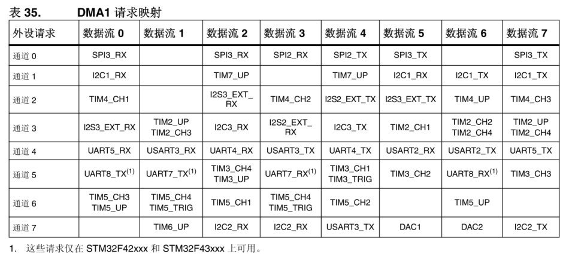
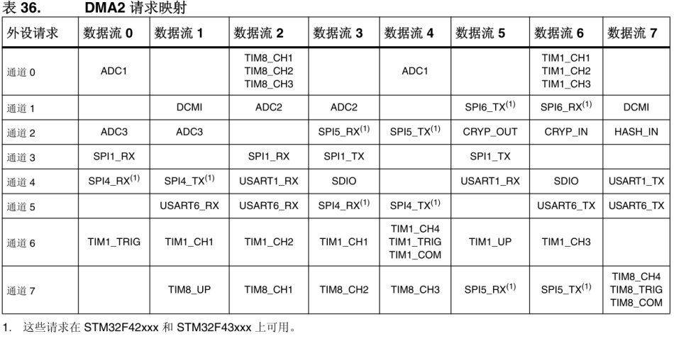

<!--
 * @Author: QianXu
 * @LastEditors: QianXu
 * @Description: NONE
 * @Date: 2019-03-10 21:52:44
 * @LastEditTime: 2019-03-10 22:50:11
 -->
## HOW TO USE

## 接法
- PA4    DCMI_HSYNC
- PA6    DCMI_PCLK
- PB7    DCMI_VSYNC
- PA9    DCMI_D0
- PA10   DCMI_D1
- PE0    DCMI_D2
- PE1    DCMI_D3
- PE4    DCMI_D4
- PB6    DCMI_D5
- PB8    DCMI_D6
- PB9    DCMI_D7

## SCCB
> 当写数据到从机被定义为写传输（write transmission），当从机中读数据被定义为读传输 (read transmission)，每一个传输都要有开始和结束来释放总线(start + sotp)

> 完整的数据传输包括两个或三个阶段，每一个阶段包含9位数据，其中高8位为所要传输的数据，最低位根据器件所处情况有不同的取值：

> 总结如下：
> 每一个阶段组成：8位数据+don't care/NA
> 如果是主机发送数据，即进行写操作，第九位就为don't care
> 如果是从机发送数据，即为读操作，第九位就为NA.
> 在进行主器件写操作时，全部阶段的最低位均是Don’t care bit

> 在进行主器件读操作时，第一阶段的最低位是自由位，第二阶段的最低位为NA

#### SCCB 写操作
> 写操作是三个阶段构成一个传输的写,每一阶段都是9位，具体如下

> ID地址（7位ID地址+1位读写控制+don't care） + 要写的寄存器地址（8位寄存器地址+don't care） +要写入的数据（8位数据+don't care）

> 要强调的是ID地址，写为8'h42,读为8'h42 , 8'h42即ID地址的读写控制位为0，8'h43即ID地址的读写控制位为1

> 总结为: start + ID地址（42）+ 寄存器地址 + 数据 + stop
<!--
*写的ID地址不是很懂
*有待更新
-->

## DMA数据流

