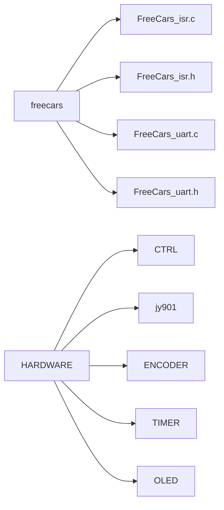

## 2019年WHU校赛平衡车
软件模块  
- freecars(上位机)
- pid(控制算法)

硬件模块  
- jy901(陀螺仪)
- 带编码器电机x2
- 电机驱动
- 光电对管
- 电池
- F4VET6

```mermaid
graph LR;
    freecars-->FreeCars_isr.c;
    freecars-->FreeCars_isr.h;
	freecars-->FreeCars_uart.c;
	freecars-->FreeCars_uart.h;
	HARDWARE-->CTRL;
	HARDWARE-->jy901;
	HARDWARE-->ENCODER;
	HARDWARE-->TIMER;
	HARDWARE-->OLED;
```