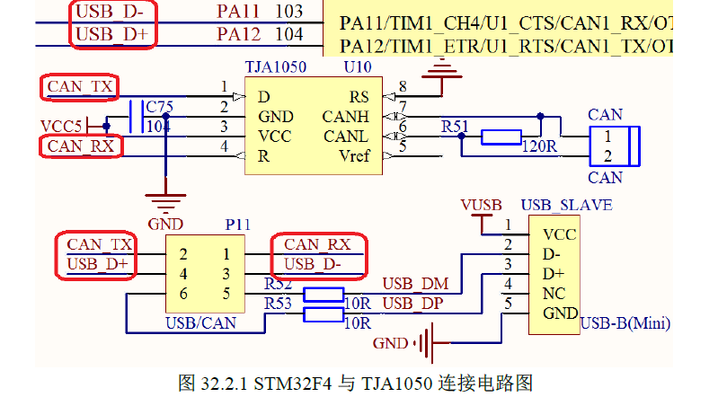

<!--
 * @Author: QianXu
 * @LastEditors: QianXu
 * @Description: NONE
 * @Date: 2019-03-11 20:21:42
 * @LastEditTime: 2019-03-13 16:58:02
 -->
## HOW TO USE
- PA11 CAN_RX  
- PA12 CAN_TX

## 电路
转接芯片TJA1050

#### CAN通信的5个类型帧
数据帧和遥控帧有标准格式和扩展格式两种格式。标准格式有11 个位的标识符（ID），扩展格式有29 个位的ID。
- 数据帧    用于发送单元向接收单元传送数据的帧
- 遥控帧    用于接收单元向具有相同 ID 的发送单元请求数据的帧
- 错误帧    用于当检测出错误时向其它单元通知错误的帧
- 过载帧    用于接收单元通知其尚未做好接收准备的帧
- 间隔帧    用于将数据帧及遥控帧与前面的帧分离开来的帧

##### 数据帧的7个段
- （1） 帧起始。表示数据帧开始的段。     
   - 标准帧和扩展帧都是由1个位的显性电平表示帧起始
- （2） 仲裁段。表示该帧优先级的段。
   - 表示数据优先级的段，标准帧和扩展帧格式在本段有所区别
   >>> 标准格式的ID 有11 个位。从ID28 到ID18 被依次发送。禁止高7 位都为隐性（禁止设定：ID=1111111XXXX）。扩展格式的ID 有29 个位。基本ID 从ID28 到ID18，扩展ID 由ID17 到ID0 表示。基本ID 和标准格式的ID 相同。禁止高7 位都为隐性（禁止设定：基本ID=1111111XXXX）。
   >>> 其中RTR位用于标识是否是远程帧（0，数据帧；1，远程帧），IDE位为标识符选择位（0，使用标准标识符；1，使用扩展标识符），SRR位为代替远程请求位，为隐性位，它代替了标准帧中的RTR位
- （3） 控制段。表示数据的字节数及保留位的段。
- （4） 数据段。数据的内容，一帧可发送0~8个字节的数据。
- （5） CRC段。检查帧的传输错误的段。
- （6） ACK段。表示确认正常接收的段。
- （7） 帧结束。表示数据帧结束的段。